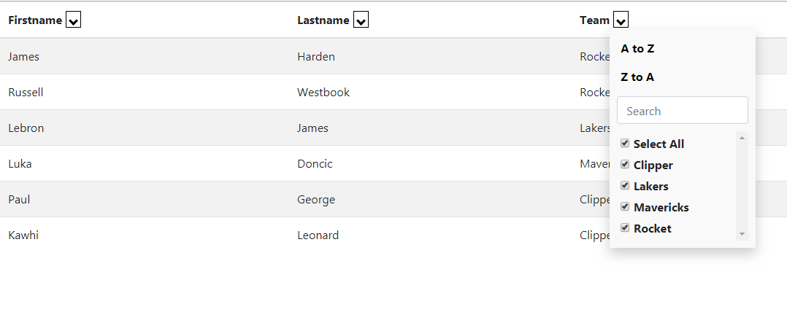

# Excel Table

<a href = https://github.com/chestercharles/excel-bootstrap-table-filter>參考 chestercharles github </a>


 


## How to use

<a href ="https://github.com/Eddie02582/Web/blob/main/Jquery%20Package/Excel%20Table/excel-bootstrap-table-filter-style.html">full example code</a>

#### Include css/script

```html
<script src="excel-bootstrap-table-filter-bundle.js"></script>
<link rel="stylesheet" href="excel-bootstrap-table-filter-style.css">
```

#### Add javasctipt
指定要excelTableFilter的table,這樣就完成了

```html
 <script>
    $('#table-info').excelTableFilter();
  </script> 
```


####  Advance
可以透過class 指定欄位是否要sort/filter
```html
    <thead>
      <tr>
        <th class = "no-filter no-sort">Firstname</th>
        <th class = "no-filter">Lastname</th>
        <th>Team</th>       
      </tr>
    </thead>
```


