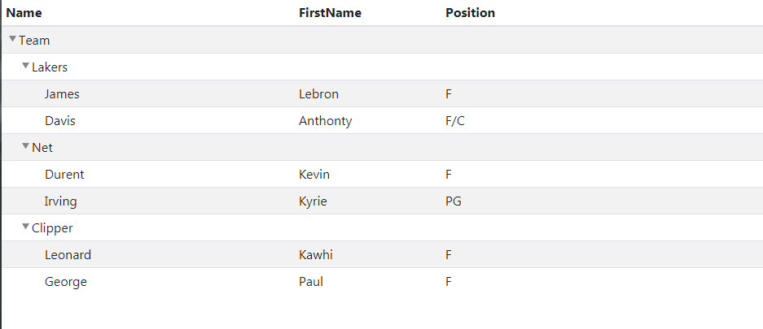

# Tree Grid


<a href = https://github.com/maxazan/jquery-treegrid>參考 maxazan github </a>


 


## 如何使用


#### 1. Include css/script


```html
  <link rel="stylesheet" href="treegrid/css/jquery.treegrid.css">
  <script src="treegrid/js/jquery.treegrid.js"></script> 
```


#### 2. html Add javasctipt
預設設定為固定第一欄<br>
若想要固定Column,將freezeColumn 設定為true,並指定要凍結的個數(columnNum)


 ``` html
<script type="text/javascript">
  $(document).ready(function() {
    $('.tree').treegrid();               
  });
</script>;
```


### 3. table
<ul>
    <li>透過 class="treegrid-[name]" 指定結點名稱</li>
    <li>透過 class="treegrid-parent-[parent_name]" 指定父結點的名稱</li>  
    <li>重複即可產生好幾層</li>  
</ul>


 ``` html
<table class="table tree table-striped">  
    <thead>  
        <tr>		             	 		
            <th width="200px">Name</th>
            <th width="100px">FirstName</th>
            <th width="220px">Position</th>    
        </tr>
    </thead>
    <tbody>    
        <tr class="treegrid-0">  
            <td>Team</td>
            <td></td>
            <td></td>             
        </tr> 
        <tr class="treegrid-team-1 treegrid-parent-0">
            <td>Lakers</td>
            <td></td>
            <td></td>                   
        </tr>
        <tr class="treegrid-team-1-palyer-1 treegrid-parent-team-1">
            <td>James</td>
            <td>Lebron</td>
            <td>F</td>                   
        </tr>        
        <tr class="treegrid-team-1-palyer-2 treegrid-parent-team-1">
            <td>Davis</td>
            <td>Anthonty</td>
            <td>F/C</td>                   
        </tr>          
        <tr class="treegrid-team-2 treegrid-parent-0">
            <td>Net</td>
            <td></td>
            <td></td>                 
        </tr>       
        <tr class="treegrid-team-1-palyer-1 treegrid-parent-team-2">
            <td>Durent</td>
            <td>Kevin</td>
            <td>F</td>                   
        </tr>           
        <tr class="treegrid-team-1-palyer-1 treegrid-parent-team-2">
            <td>Irving</td>
            <td>Kyrie</td>
            <td>PG</td>                   
        </tr>   
        <tr class="treegrid-team-3 treegrid-parent-0">
            <td>Clipper</td>
            <td></td>
            <td></td>                 
        </tr>       
        <tr class="treegrid-team-1-palyer-2 treegrid-parent-team-3">
            <td>Leonard</td>
            <td>Kawhi</td>
            <td>F</td>                   
        </tr>           
        <tr class="treegrid-team-1-palyer-1 treegrid-parent-team-3">
            <td>George</td>
            <td>Paul</td>
            <td>F</td>                   
        </tr>         
    </tbody>  
</table>


```


